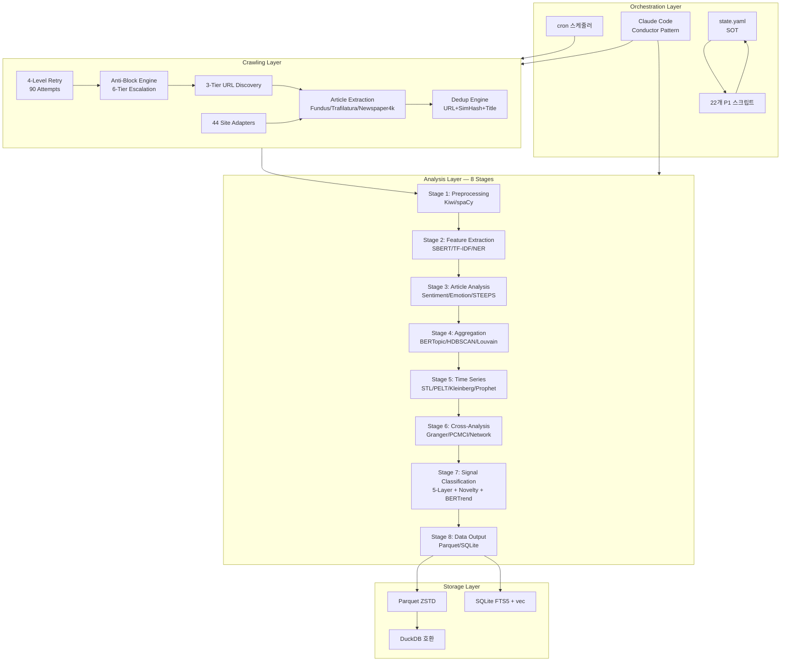
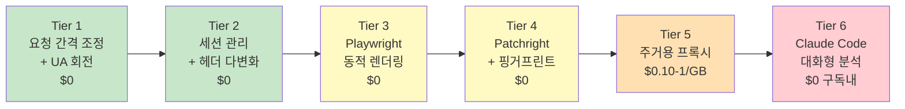
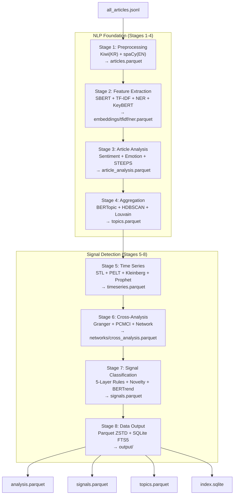
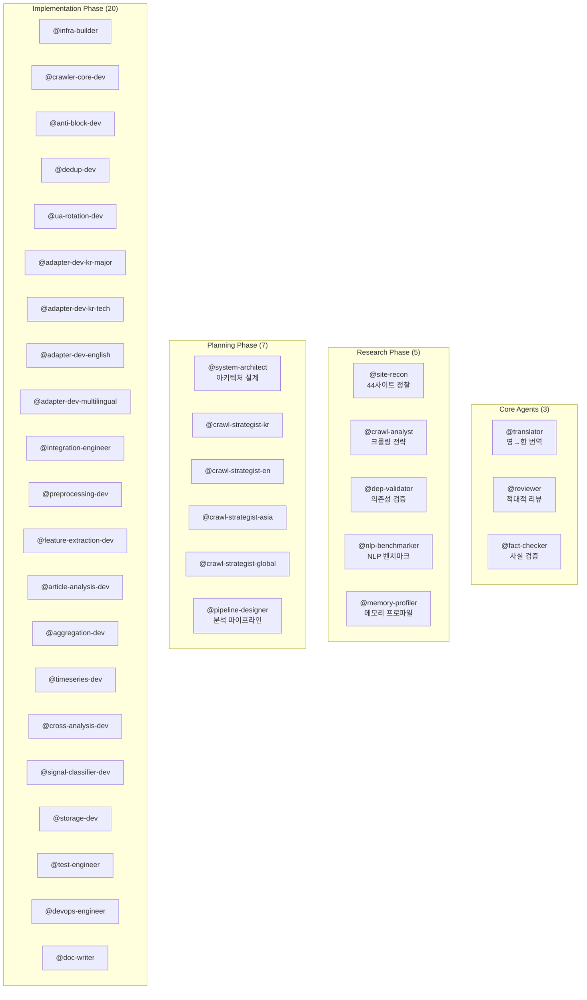

# GlobalNews Architecture & Design

> **GlobalNews Crawling & Analysis Auto-Build System — 아키텍처 전체 조감도**

이 문서는 GlobalNews 자식 시스템의 아키텍처를 기술한다.
부모 프레임워크(AgenticWorkflow)의 아키텍처는 [`AGENTICWORKFLOW-ARCHITECTURE-AND-PHILOSOPHY.md`](AGENTICWORKFLOW-ARCHITECTURE-AND-PHILOSOPHY.md)를 참조한다.

| 항목 | 내용 |
|------|------|
| **아키텍처 스타일** | Staged Monolith (단계적 모놀리스) |
| **실행 환경** | MacBook M2 Pro 16GB, Python 3.10+ |
| **외부 API 비용** | $0 (Claude API 미사용, 로컬 NLP만) |
| **데이터 스토리지** | Parquet (ZSTD) + SQLite (FTS5 + sqlite-vec) |
| **오케스트레이션** | Claude Code (구독제) — Conductor Pattern |

---

## 1. 시스템 아키텍처 개요

### 1.1 4-Layer Architecture



### 1.2 Staged Monolith 설계 근거

마이크로서비스가 아닌 **단계적 모놀리스**를 채택한다:

| 근거 | 설명 |
|------|------|
| 단일 머신 | MacBook M2 Pro 16GB — 분산 불필요 |
| 통신 오버헤드 제거 | 컴포넌트 간 직접 함수 호출 |
| 운영 단순성 | 단일 프로세스, 단일 배포 |
| 모듈 경계 유지 | 필요 시 각 Stage를 독립 프로세스로 분리 가능 |

### 1.3 Conductor Pattern (Claude Code 역할)

Claude Code(구독제)는 **데이터를 직접 처리하지 않는다**. Generate → Execute → Read → Decide 루프를 수행한다:

```
┌──────────────────────────────────────────────┐
│           Claude Code (구독제)                 │
│  ┌──────────┐  ┌──────────┐  ┌──────────┐   │
│  │ Generate  │→│ Execute   │→│ Read &    │   │
│  │ Python    │  │ via Bash  │  │ Decide    │   │
│  │ Scripts   │  │ Tool      │  │ Next Step │   │
│  └──────────┘  └──────────┘  └──────────┘   │
│       ↑                            │          │
│       └────────────────────────────┘          │
│              (결과 기반 다음 판단)              │
└──────────────────────────────────────────────┘
```

| 컴포넌트 | 역할 | 비용 | 비중 |
|---------|------|------|------|
| **cron + Python** | 일상 크롤링 + 분석 | $0 | 95% |
| **Claude Code** | 워크플로우 설계, 스크립트 생성, Tier 6 | $0 (구독 내) | 5% |

---

## 2. 크롤링 엔진 아키텍처

### 2.1 Dynamic-First 전체 사이트 크롤링

기존 RSS/API 기반 도구와 달리, **모든 섹션을 동적으로 탐색**한다:

```
사이트 진입
  ↓
[Phase 1: 정적 발견] ─── 60-70% 커버리지
  • sitemap.xml 파싱 → 전체 URL 목록
  • RSS 피드 파싱 → 최신 기사 URL
  ↓
[Phase 2: DOM 탐색] ─── 추가 15-20%
  • 네비게이션 메뉴에서 섹션 URL 추출
  • 각 섹션 페이지 방문 → 기사 링크 추출
  • 페이지네이션 처리
  ↓
[Phase 3: 동적 크롤링] ─── 나머지 10-20%
  • Playwright/Patchright로 JavaScript 렌더링
  • 무한 스크롤 + "Load More" 자동 클릭
  • AJAX 로딩 기사 목록 처리
  ↓
[Phase 4: 엣지 케이스]
  • 실패 URL 재시도 (exponential backoff)
  • Tier 6 Claude Code 대화형 분석
```

### 2.2 기사 추출 기술 스택 (Fallback Chain)

| 순위 | 라이브러리 | F1 Score | 용도 |
|------|----------|---------|------|
| 1차 | **Fundus** 0.4.x | 0.977 | 지원 매체 (~39개 영어 매체) |
| 2차 | **Trafilatura** 2.0.0 | 0.958 | 범용 (최고 Recall 0.978) |
| 3차 | **Newspaper4k** | 0.90+ | 폴백 (한국어 매체 추가 지원) |

### 2.3 적응형 차단 돌파 시스템

#### 7가지 차단 유형 진단

| # | 차단 유형 | 증상 | 자동 진단 |
|---|----------|------|----------|
| B1 | IP 차단 | HTTP 403/429 | 응답 코드 모니터링 |
| B2 | User-Agent 필터링 | 특정 UA 차단 | UA 회전 후 응답 비교 |
| B3 | Rate Limiting | 연속 요청 시 지연 | 요청 간격 vs 응답 시간 |
| B4 | CAPTCHA | CAPTCHA 리다이렉션 | HTML 패턴 감지 |
| B5 | JavaScript 챌린지 | Cloudflare/Akamai | JS 실행 요구 감지 |
| B6 | 핑거프린트 탐지 | 브라우저 특성 차단 | CDP 프로토콜 감지 |
| B7 | Geo-Block | IP 지역 차단 | 다른 지역 프록시 확인 |

#### 6-Tier 에스컬레이션



| Tier | 전략 | 비용 | 자동화 |
|------|------|------|--------|
| 1 | 요청 간격 조정 (5→10→15초) + UA 회전 | $0 | 완전 자동 |
| 2 | 세션 관리 (쿠키 순환 + Referer) + 헤더 다변화 | $0 | 완전 자동 |
| 3 | Playwright/Patchright 동적 렌더링 | $0 | 완전 자동 |
| 4 | Patchright + fingerprint-suite (위장) | $0 | 완전 자동 |
| 5 | 주거용 프록시 회전 (DataImpulse 등) | $0.10-1/GB | 완전 자동 |
| 6 | Claude Code 실패 로그 분석 → Python 우회 코드 생성 | $0 (구독) | **반자동** |

### 2.4 4-Level Retry System (90 Automated Attempts)

```
NetworkGuard(5) × Standard+TotalWar(2) × Crawler(3) × Pipeline(3) = 90
```

| Level | 위치 | 재시도 | 설명 |
|-------|------|--------|------|
| **L1 — NetworkGuard** | HTTP 요청 | 5회 | 개별 HTTP 요청 레벨 (exponential backoff) |
| **L2 — Mode** | 크롤링 모드 | 2가지 | Standard → TotalWar (undetected-chromedriver) |
| **L3 — Crawler** | 사이트 레벨 | 3라운드 | 사이트별 3라운드 (증가하는 지연) |
| **L4 — Pipeline** | 전체 파이프라인 | 3회 | 전체 재시작 (이미 수집된 URL 보존) |

> 90회 자동 시도 후 → **Tier 6 에스컬레이션** (Claude Code 대화형). 파이프라인은 종료하지 않고 에스컬레이션한다.

### 2.5 Circuit Breaker 패턴

| 상태 | 조건 | 동작 |
|------|------|------|
| **Closed** (정상) | 연속 성공 | 정상 크롤링 계속 |
| **Open** (차단) | 연속 실패 5회 | 크롤링 중단, 30분 대기, Tier 에스컬레이션 |
| **Half-Open** (시험) | 대기 후 | 단일 요청 테스트, 성공 시 Closed 복귀 |

### 2.6 중복 제거 (3-Level)

| 수준 | 방법 | 설명 |
|------|------|------|
| URL 정규화 | 쿼리 파라미터 제거 + 정규화 | `?utm_source=...` 등 제거 |
| 콘텐츠 해시 | SimHash/MinHash | 본문 유사도 95%+ 중복 판정 |
| 제목 유사도 | Jaccard + 편집거리 | 동일 기사의 다른 매체 버전 탐지 |

### 2.7 Site Adapter 패턴 (44개)

각 사이트에 대해 전용 어댑터를 구현한다. 어댑터는 공통 인터페이스(`BaseSiteAdapter`)를 상속하고 사이트별 CSS 셀렉터, 네비게이션 패턴, 인코딩, 페이지네이션 방식을 캡슐화한다.

| 그룹 | 어댑터 수 | 개발 에이전트 | 대표 사이트 |
|------|------:|-------------|-----------|
| Korean Major + Economy + Niche | 12 | `@adapter-dev-kr-major` | chosun.com, mk.co.kr, ohmynews.com |
| Korean IT/Science | 7 | `@adapter-dev-kr-tech` | bloter.net, etnews.com, zdnet.co.kr |
| US/English Major | 12 | `@adapter-dev-english` | nytimes.com, bloomberg.com, cnn.com |
| Asia-Pacific + Europe/ME | 13 | `@adapter-dev-multilingual` | people.com.cn, aljazeera.com, bild.de |

---

## 3. 분석 파이프라인 아키텍처

### 3.1 8-Stage Pipeline



### 3.2 Stage별 상세

| Stage | 입력 | 출력 | 핵심 기법 | 라이브러리 |
|-------|------|------|----------|-----------|
| **1. Preprocessing** | JSONL | `articles.parquet` | 형태소 분석, 언어 감지, 토큰화, 정규화 | Kiwi, spaCy, langdetect |
| **2. Feature Extraction** | articles.parquet | embeddings/tfidf/ner.parquet | SBERT 임베딩, TF-IDF, NER, KeyBERT, FastText | sentence-transformers, scikit-learn, keybert |
| **3. Article Analysis** | articles.parquet + features | `article_analysis.parquet` | 감정 분석, 8-감정, STEEPS 분류, 중요도 | KoBERT, KcELECTRA, bart-large-mnli |
| **4. Aggregation** | analysis + features | `topics.parquet` | BERTopic, DTM, HDBSCAN, NMF/LDA, Louvain | bertopic, Model2Vec, hdbscan, networkx |
| **5. Time Series** | topics + analysis | `timeseries.parquet` | STL 분해, Kleinberg 버스트, PELT 변화점, Prophet, Wavelet | statsmodels, ruptures, prophet, pywt |
| **6. Cross-Analysis** | all prior stages | networks/cross.parquet | Granger 인과, PCMCI, 공출현 네트워크, 교차 언어, 프레임 분석 | statsmodels, tigramite, networkx |
| **7. Signal Classification** | all prior stages | `signals.parquet` | 5-Layer 규칙, Novelty(LOF/IF), BERTrend, Dual-Pass | scikit-learn, custom rules |
| **8. Data Output** | all results | output/ | Parquet ZSTD, SQLite FTS5+vec, DuckDB 호환 | pyarrow, sqlite3, sqlite-vec |

### 3.3 메모리 관리 전략

M2 Pro 16GB 제약 하에서 8-Stage 파이프라인을 실행하기 위한 전략:

```
Stage N 시작
  → 모델 로드
  → 데이터 처리
  → Parquet 저장
  → 모델 del + gc.collect() + torch.cuda.empty_cache()
Stage N+1 시작
```

| 제약 | 값 |
|------|-----|
| 피크 메모리 (전체) | < 10GB |
| 피크 메모리 (단일 Stage) | ≤ 5GB |
| 처리 속도 | ≤ 15분 / 1,000기사 (Stage 1-4) |
| E2E 시간 | ≤ 3시간 (크롤링 + 분석) |

### 3.4 5-Layer 신호 계층 아키텍처

```
                          시간 →
    ┌─────────────────────────────────────────────┐
L5  │ ●                     ●                     │ Singularity (> 12m)
    │   ●                                         │   복합 7지표 ≥ 0.65
    ├─────────────────────────────────────────────┤
L4  │ ▬▬▬▬▬▬▬▬▬▬▬▬▬▬▬▬▬▬▬▬▬▬▬▬▬                 │ Long-term (3-12m)
    │   임베딩 드리프트 + Wavelet                  │   STEEPS 지속성
    ├─────────────────────────────────────────────┤
L3  │ ████████████████                             │ Mid-term (2-12w)
    │   PELT 변화점 + 네트워크 진화                │   프레임 전환
    ├─────────────────────────────────────────────┤
L2  │ ░░░░░░░░░                                    │ Short-term (2-14d)
    │   BERTopic DTM + 감정 궤적                   │   이동평균 교차
    ├─────────────────────────────────────────────┤
L1  │ ▌▌▌                                          │ Fad (< 48h)
    │   Kleinberg 버스트 + Z-score                 │   이상 탐지
    └─────────────────────────────────────────────┘
```

| Layer | 시간 범위 | 핵심 탐지 기법 | 최소 데이터 |
|-------|----------|-------------|-----------|
| **L1 Fad** | < 48h ~ 2주 | Kleinberg 버스트 + Z-score | 7일 |
| **L2 Short** | 2주 ~ 3개월 | BERTopic DTM + 감정 궤적 + MA 교차 | 30일 |
| **L3 Mid** | 3개월 ~ 1년 | PELT 변화점 + 네트워크 진화 + 프레임 | 6개월 |
| **L4 Long** | 1 ~ 5년 | 임베딩 드리프트 + Wavelet + STEEPS | 2년+ |
| **L5 Singularity** | 비주기 | Novelty + CrossDomain + BERTrend + 복합 7지표 | 6개월+ |

### 3.5 Dual-Pass 분석 전략

| Pass | 대상 | 역할 | 기법 |
|------|------|------|------|
| **Pass 1: 제목** | 기사 제목 | 신호 탐지 (빠른 스캔) | 키워드 빈도, 버스트 감지, 감정 극성 |
| **Pass 2: 본문** | 기사 전문 | 증거 확보 (심층 분석) | NER, 토픽 모델링, 프레임 분석, 인과 추론 |

> 제목은 "**무엇이** 일어나고 있는가"를, 본문은 "**왜, 어떻게** 일어나고 있는가"를 답한다.

### 3.6 싱귤래리티 탐지 (L5)

3가지 독립 경로 교차 검증:

| 경로 | 방법 | 설명 |
|------|------|------|
| OOD 감지 | LOF + Isolation Forest | 기존 토픽에 속하지 않는 기사 |
| 변화점 감지 | PELT + 확률 분포 변화 | 구조적 전환점 |
| BERTrend | weak signal → emerging 전환 | 약한 신호의 첫 출현 포착 |

**복합 점수 공식**:

```
S = w1×OOD + w2×Changepoint + w3×CrossDomain + w4×BERTrend
  + w5×Entropy + w6×Novelty + w7×Network
```

---

## 4. 데이터 아키텍처

### 4.1 데이터 플로우

```
sources.yaml
  ↓
[크롤링] → raw/all_articles.jsonl (일일 단일 파일)
  ↓
[Stage 1] → data/processed/articles.parquet
  ↓
[Stage 2] → data/features/{embeddings,tfidf,ner}.parquet
  ↓
[Stage 3] → data/analysis/article_analysis.parquet
  ↓
[Stage 4] → data/analysis/topics.parquet
  ↓
[Stage 5] → data/analysis/timeseries.parquet
  ↓
[Stage 6] → data/analysis/{networks,cross_analysis}.parquet
  ↓
[Stage 7] → data/output/signals.parquet
  ↓
[Stage 8] → data/output/
  ├── analysis.parquet   (전체 통합)
  ├── signals.parquet    (5-Layer 신호)
  ├── topics.parquet     (토픽 모델)
  └── index.sqlite       (FTS5 + sqlite-vec)
```

### 4.2 Parquet 스키마

#### articles.parquet (기사 원본)

| 컬럼 | 타입 | 설명 |
|------|------|------|
| `article_id` | STRING | 고유 ID (UUID) |
| `url` | STRING | 원본 URL |
| `title` | STRING | 기사 제목 |
| `body` | STRING | 기사 본문 |
| `source` | STRING | 소스 사이트명 |
| `category` | STRING | 카테고리 |
| `language` | STRING | 언어 코드 (ko/en) |
| `published_at` | TIMESTAMP | 발행일시 |
| `crawled_at` | TIMESTAMP | 수집일시 |
| `author` | STRING (nullable) | 저자 |
| `word_count` | INT32 | 단어 수 |
| `content_hash` | STRING | 본문 해시 (중복 제거) |

#### analysis.parquet (분석 결과)

| 컬럼 | 타입 | 설명 |
|------|------|------|
| `article_id` | STRING | FK → articles |
| `sentiment_label` | STRING | positive/negative/neutral |
| `sentiment_score` | FLOAT | -1.0 ~ 1.0 |
| `emotion_{joy,trust,fear,surprise,sadness,disgust,anger,anticipation}` | FLOAT | Plutchik 8차원 (0-1) |
| `topic_id` | INT32 | BERTopic 토픽 ID |
| `topic_label` | STRING | 토픽 레이블 |
| `topic_probability` | FLOAT | 소속 확률 |
| `steeps_category` | STRING | S/T/E/En/P/Se |
| `importance_score` | FLOAT | 중요도 (0-100) |
| `keywords` | LIST\<STRING\> | KeyBERT Top 10 |
| `entities_{person,org,location}` | LIST\<STRING\> | NER 개체 |
| `embedding` | LIST\<FLOAT\> | SBERT 벡터 (384-dim) |

#### signals.parquet (5-Layer 신호)

| 컬럼 | 타입 | 설명 |
|------|------|------|
| `signal_id` | STRING | 고유 ID |
| `signal_layer` | STRING | L1_fad / L2_short / L3_mid / L4_long / L5_singularity |
| `signal_label` | STRING | 신호 레이블 |
| `detected_at` | TIMESTAMP | 탐지 시점 |
| `topic_ids` | LIST\<INT32\> | 관련 토픽 |
| `article_ids` | LIST\<STRING\> | 관련 기사 |
| `burst_score` | FLOAT | Kleinberg 버스트 |
| `changepoint_significance` | FLOAT | 변화점 유의도 |
| `novelty_score` | FLOAT | LOF/IF 이상 점수 |
| `singularity_composite` | FLOAT | L5 복합 점수 |
| `evidence_summary` | STRING | 탐지 근거 |
| `confidence` | FLOAT | 분류 신뢰도 (0-1) |

### 4.3 SQLite 스키마

```sql
-- FTS5 전문 검색
CREATE VIRTUAL TABLE articles_fts USING fts5(
    article_id UNINDEXED, title, body,
    source UNINDEXED, category UNINDEXED,
    language UNINDEXED, published_at UNINDEXED,
    tokenize='unicode61'
);

-- sqlite-vec 벡터 검색
CREATE VIRTUAL TABLE article_embeddings USING vec0(
    article_id TEXT PRIMARY KEY,
    embedding FLOAT[384]
);

-- 신호/토픽/크롤링 인덱스 테이블
CREATE TABLE signals_index (...);
CREATE TABLE topics_index (...);
CREATE TABLE crawl_status (...);
```

---

## 5. 에이전트 아키텍처

### 5.1 에이전트 구성 (35개)



### 5.2 Agent Team 구성

| 단계 | 팀명 | 멤버 | 패턴 |
|------|------|------|------|
| Step 2 | `tech-validation-team` | `@dep-validator`, `@nlp-benchmarker`, `@memory-profiler` | 병렬 실행 |
| Step 6 | `crawl-strategy-team` | 4x `@crawl-strategist-{kr,en,asia,global}` | 병렬 실행 (사이트 그룹별) |
| Step 10 | `crawl-engine-team` | `@crawler-core-dev`, `@anti-block-dev`, `@dedup-dev`, `@ua-rotation-dev` | Dense Checkpoint |
| Step 11 | `site-adapters-team` | 4x `@adapter-dev-{kr-major,kr-tech,english,multilingual}` | Dense Checkpoint (44개 어댑터) |
| Step 13 | `analysis-foundation-team` | `@preprocessing-dev`, `@feature-extraction-dev`, `@article-analysis-dev`, `@aggregation-dev` | Dense Checkpoint |
| Step 14 | `analysis-signal-team` | `@timeseries-dev`, `@cross-analysis-dev`, `@signal-classifier-dev`, `@storage-dev` | Dense Checkpoint |

### 5.3 Dense Checkpoint 패턴

팀 단계에서 각 멤버는 3개 체크포인트(CP-1, CP-2, CP-3)에서 진행 보고한다. Team Lead가 각 체크포인트를 검토하여 품질을 조기에 확보한다:

```
Teammate 작업 시작
  → CP-1 보고 (기본 기능 완성)
  → Team Lead 검토 + SendMessage 피드백
  → CP-2 보고 (핵심 기능 완성)
  → Team Lead 검토 + SendMessage 피드백
  → CP-3 보고 (전체 완성 + 검증)
  → Team Lead 종합 검증
  → SOT tasks_completed 갱신
```

---

## 6. Orchestrator 인프라

### 6.1 SOT (Single Source of Truth) 스키마

`state.yaml` — 워크플로우 전체 상태를 단일 파일에 관리. `sot_manager.py`로 fcntl 잠금 기반 atomic 조작:

```yaml
workflow:
  name: GlobalNews Crawling & Analysis Auto-Build
  current_step: 1        # 현재 단계 (1-20)
  status: in_progress     # in_progress | completed | blocked
  total_steps: 20
  parent_genome:           # DNA 유전 기록
    source: AgenticWorkflow
    inherited_dna: [...]
  autopilot:
    enabled: false
    auto_approved_steps: []
  outputs: {}              # step-N: path/to/output
  verification:
    last_verified_step: 0
    retries: {}
  pacs:
    current_step_score: null
    dimensions: {F: null, C: null, L: null}
    weak_dimension: null
    pre_mortem_flag: null
    history: {}
  active_team: null        # 진행 중인 팀 상태
```

### 6.2 22개 Orchestrator 스크립트

| 스크립트 | 역할 | 호출 시점 |
|---------|------|----------|
| `sot_manager.py` | SOT atomic 조작 (읽기/쓰기/전진/pACS/팀) | 매 단계 |
| `workflow_starter.py` | 워크플로우 시작 컨텍스트 생성 | 최초 시작 |
| `validate_step_transition.py` | 단계 전환 사전 검증 (ST1-ST6) | 단계 전진 전 |
| `run_quality_gates.py` | L0→L1→L1.5→L2 순차 실행 | 산출물 저장 후 |
| `validate_site_coverage.py` | 44사이트 커버리지 (SC1-SC4) | Steps 1, 6, 11 |
| `validate_technique_coverage.py` | 56기법 커버리지 (TC1-TC4) | Step 7 |
| `validate_code_structure.py` | 코드 구조 (CS1-CS5) | Steps 9-15 |
| `validate_data_schema.py` | Parquet/SQLite 스키마 (DS1-DS3) | Steps 5, 9 |
| `validate_team_state.py` | 팀 상태 일관성 (TS1-TS4) | Steps 2, 6, 10-14 |
| `extract_orchestrator_step_guide.py` | Playbook 단계별 가이드 추출 | 에이전트 컨텍스트 주입 |
| `extract_site_urls.py` | PRD에서 사이트 목록 추출 | Step 1 |
| `generate_sources_yaml_draft.py` | sources.yaml 초안 생성 | Step 1 |
| `split_sites_by_group.py` | 44사이트 → 4그룹 분배 | Step 6 |
| `distribute_sites_to_teams.py` | 44사이트 → 4팀 배분 | Step 11 |
| `merge_recon_and_deps.py` | Step 1-2 산출물 병합 | Step 3 |
| `filter_prd_architecture.py` | PRD §6-8 아키텍처 추출 | Step 5 |
| `filter_prd_analysis.py` | PRD §5.2 분석 기법 추출 | Step 7 |
| `extract_architecture_crawling.py` | 크롤링 아키텍처 추출 | Step 10 |
| `extract_pipeline_design_s1_s4.py` | Stage 1-4 파이프라인 추출 | Step 13 |
| `extract_pipeline_design_s5_s8.py` | Stage 5-8 파이프라인 추출 | Step 14 |
| `calculate_success_metrics.py` | PRD §9.1 성공 지표 계산 | Step 16 |
| `verify_adapter_coverage.py` | 44사이트 어댑터 완전성 | Step 11 |

### 6.3 P1 검증 매트릭스

스크립트별 결정론적 검증 항목:

| 검증 코드 | 스크립트 | 검증 내용 |
|----------|---------|----------|
| SC1-SC4 | `validate_site_coverage.py` | 44개 사이트 전수 존재, URL 형식, 그룹 완전성 |
| TC1-TC4 | `validate_technique_coverage.py` | 56개 기법 매핑, Stage 배정, 라이브러리 명시 |
| CS1-CS5 | `validate_code_structure.py` | 디렉터리 구조, 필수 파일, import, CLI, 어댑터 |
| DS1-DS3 | `validate_data_schema.py` | Parquet 컬럼, SQLite 테이블, 설정 파일 |
| TS1-TS4 | `validate_team_state.py` | 팀 필드 존재, 상태 일관성, 완료 기록 |
| ST1-ST6 | `validate_step_transition.py` | 현재 단계, 산출물, 검증 로그, pACS, 리뷰, 팀 |

### 6.4 4계층 품질 보장 시스템

```
L0 Anti-Skip Guard (결정론적)
  → 산출물 파일 존재 + 최소 크기 (100 bytes)
  ↓
L1 Verification Gate (의미론적)
  → 워크플로우의 Verification 기준 100% 달성
  → 실패 시 최대 10회 재시도 (ULW: 15회)
  ↓
L1.5 pACS Self-Rating (신뢰도)
  → Pre-mortem Protocol → F/C/L 3차원 채점
  → RED(< 50): 재작업 | YELLOW(50-69): 경고 | GREEN(≥ 70): 진행
  ↓
L2 Adversarial Review (비판적)
  → @reviewer 또는 @fact-checker가 독립 검증
  → PASS/FAIL → FAIL 시 재작업
```

---

## 7. 한국어 NLP 스택

이 시스템의 핵심 차별화 중 하나는 한국어+영어 융합 분석이다:

| 용도 | 한국어 | 영어 |
|------|--------|------|
| 형태소 분석 | **Kiwi** (kiwipiepy 0.22.2) | **spaCy** |
| 감정 분석 (뉴스) | **KoBERT** (F1=94%) | 로컬 transformer |
| 감정 분석 (비격식) | **KcELECTRA** (F1=90.6%) | — |
| NER | **KLUE-RoBERTa-large** | **spaCy** |
| 문서 임베딩 | **snowflake-arctic-embed-l-v2.0-ko** | **all-MiniLM-L6-v2** |
| 토픽 모델링 | **BERTopic** + **Model2Vec** (CPU 500x) | 동일 |
| Zero-shot 분류 | — | **facebook/bart-large-mnli** |
| Few-shot 분류 | **SetFit** (8개 예시) | 동일 |
| 교차 언어 정렬 | 다국어 SBERT 임베딩 | ← 동일 공간 |

> **중요**: 모든 모델은 **로컬에서 실행**된다. Claude API 호출 = $0 (제약 C1).

---

## 8. 실행 모델

### 8.1 일상 운영 (구축 완료 후)

| 모드 | 빈도 | 트리거 | 설명 |
|------|------|--------|------|
| 자율 크롤링 | 매일 02:00 AM | cron | Tier 1-5 자율 실행 |
| 자율 분석 | 크롤링 직후 | cron 체인 | 8-Stage 자동 실행 |
| 구조 재스캔 | 주 1회 (일요일 01:00) | cron | 사이트 네비게이션 변경 감지 |
| 엣지 케이스 | 필요 시 | 수동 | Claude Code Tier 6 |
| 모델 재학습 | 월 1회 | 수동 | BERTopic/SetFit 업데이트 |

### 8.2 자기 복구 (Self-Recovery)

| 장애 유형 | 자동 복구 |
|----------|----------|
| 파이프라인 크래시 | 체크포인트 기반 재시작 |
| 잠금 파일 잔존 | stale lock 감지 + 정리 |
| 디스크 부족 | 실행 전 용량 확인 |
| 이전 실행 잔존 | 이전 원시 데이터 아카이빙 |

---

## 9. DNA 유전 (부모 프레임워크로부터)

이 시스템은 AgenticWorkflow 부모 프레임워크의 전체 게놈을 **구조적으로 내장**한다:

| DNA | 부모에서 유전 | 자식에서 발현 |
|-----|-------------|-------------|
| 절대 기준 (품질 절대주의) | 품질 > 모든 것 | 44개 사이트 전부 수집 = 품질 |
| SOT 패턴 | 단일 파일 상태 관리 | `state.yaml` + `sot_manager.py` |
| 3단계 구조 | Research → Planning → Implementation | Steps 1-4 → 5-8 → 9-20 |
| 4계층 QA | L0 → L1 → L1.5 → L2 | 22개 P1 스크립트 + pACS + Review |
| Safety Hooks | 위험 명령 차단 | 크롤링 합법성 (C5) 강제 |
| Adversarial Review | Generator-Critic 패턴 | `@reviewer`(5 steps) + `@fact-checker`(2 steps) |
| Context Preservation | 스냅샷 + RLM | 세션 경계 안전 |

### 도메인 고유 변이

부모 게놈에 **없는** 이 자식 시스템 고유의 유전자:

| 변이 | 설명 |
|------|------|
| **D2 "Never Give Up"** | 4-level retry (90회) + 6-Tier 에스컬레이션 + 자기 수정 코드 |
| **44-Site Adapter Pattern** | 사이트별 전용 어댑터 + 자동 팀 배분 |
| **8-Stage Sequential Pipeline** | 메모리 관리 기반 Stage 간 직렬 실행 |
| **5-Layer Signal Hierarchy** | Fad → Short → Mid → Long → Singularity |
| **Dual-Pass Analysis** | Title pass (탐지) → Body pass (증거) |
| **Dense Checkpoint** | 팀 멤버별 CP-1/CP-2/CP-3 조기 품질 확보 |

---

## 10. 관련 문서

| 문서 | 내용 |
|------|------|
| [`GLOBALNEWS-README.md`](GLOBALNEWS-README.md) | 시스템 개요, 빠른 시작 |
| [`GLOBALNEWS-USER-MANUAL.md`](GLOBALNEWS-USER-MANUAL.md) | 워크플로우 실행 가이드 |
| [`prompt/workflow.md`](prompt/workflow.md) | 20-step 설계도 |
| [`ORCHESTRATOR-PLAYBOOK.md`](ORCHESTRATOR-PLAYBOOK.md) | 단계별 실행 가이드 |
| [`coding-resource/PRD.md`](coding-resource/PRD.md) | 제품 요구사항 정의서 |
| [`AGENTICWORKFLOW-ARCHITECTURE-AND-PHILOSOPHY.md`](AGENTICWORKFLOW-ARCHITECTURE-AND-PHILOSOPHY.md) | 부모 프레임워크 아키텍처 |
